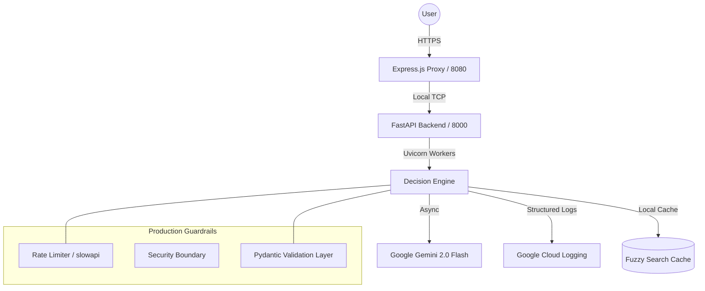

# अंतर्मन (Antarman) — Decision Intelligence "Life OS" 🕉️

> **"He who possesses a clear inner voice (Antarman) can navigate any storm."**

Antarman is a production-grade Decision Intelligence system designed to help high-achievers maintain balance across the four Vedic pillars of life: **Dharma** (Purpose), **Artha** (Wealth), **Kama** (Relationships), and **Moksha** (Health).

## 🏛️ System Architecture

Our architecture is designed for **Scalability, Security, and Accessibility**.



## 🚀 Key Production Features

### 1. 🧠 Intelligent Decision Engine
- **Gemini 2.0 Flash Integration:** Real-time event classification and life-impact scoring.
- **What-If Simulation:** A 7-day projection engine that visualizes the "ripple effect" of potential decisions.
- **Fuzzy Cache System:** Sub-10ms response times for common scenarios using a word-overlap fuzzy matcher.

### 2. 🛡️ Industry-Standard Reliability
- **Rate Limiting:** Global endpoint protection via `slowapi` (20/min global, 5/min LLM).
- **Multi-Worker Concurrency:** Backend scaled with 2+ Uvicorn workers for non-blocking I/O.
- **Comprehensive Testing:** Full `pytest` suite covering API integrity, rate-limit edge cases, and schema validation.

### 3. ♿ Accessible & Inclusive Design
- **High-Contrast Vedic Palette:** Designed using Okabe-Ito colorblind-friendly tokens.
- **Screen Reader Optimized:** Full ARIA roles and labels for complex SVG visualizations and Chakra rings.

### 4. 📊 Cloud-Native Observability
- **Google Cloud Logging:** Integrated directly with GCP operations for enterprise-grade monitoring.
- **Latency Tracking:** Real-time performance metrics (ms) for every AI interaction.

## 🛠️ Quick Start

### Prerequisites
- Python 3.9+
- Node.js 18+
- Google Gemini API Key

### Local Run
1. **Backend:**
   ```bash
   cd backend
   pip install -r requirements.txt
   uvicorn main:app --port 8000
   ```
2. **Frontend:**
   ```bash
   cd frontend
   npm install
   node src/flows/analyze.js
   ```
3. Open `http://localhost:8080`

---
*Built with ❤️ for the Google Promptwars / Decision Intelligence Hackathon.*
